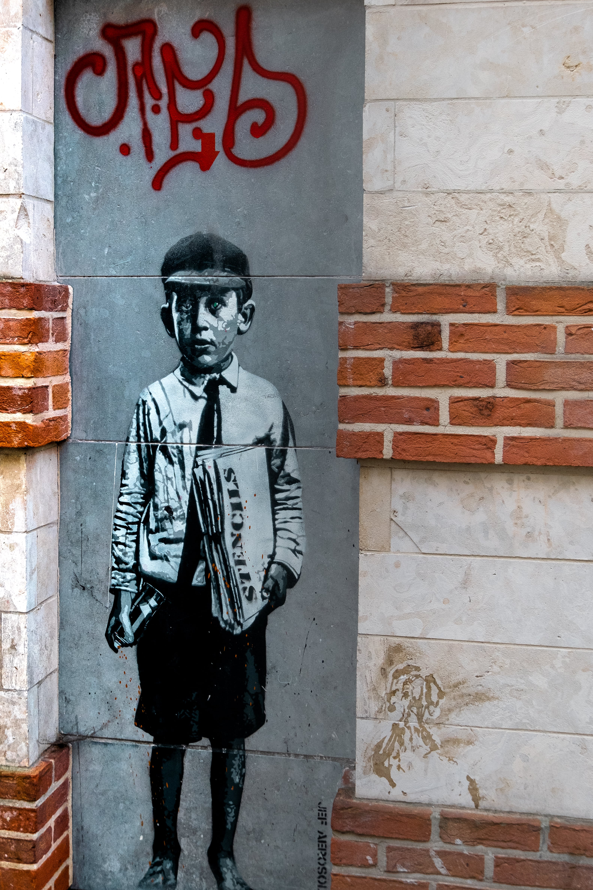
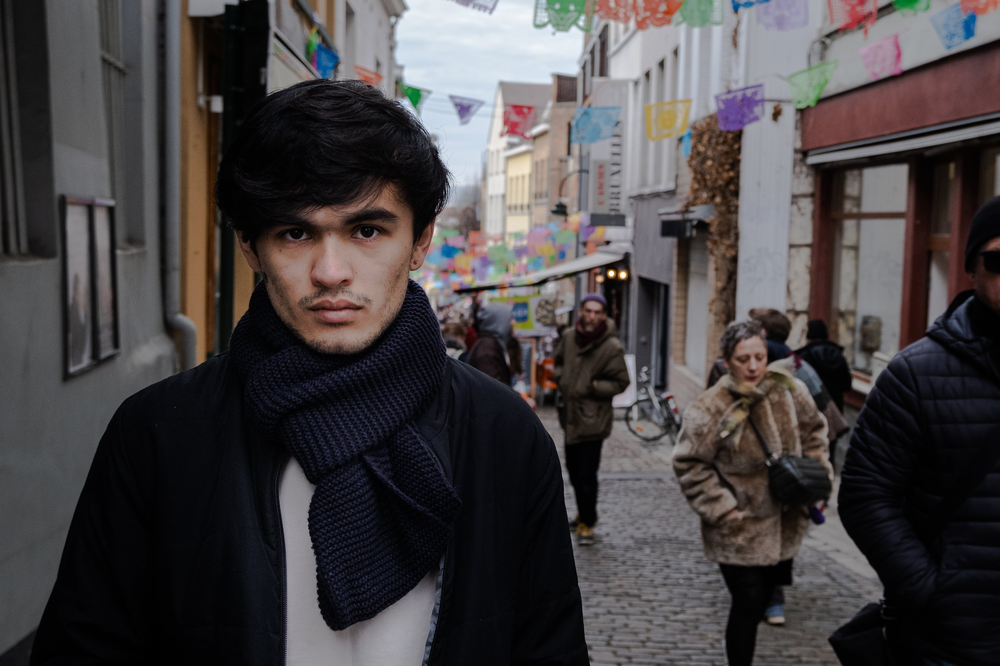
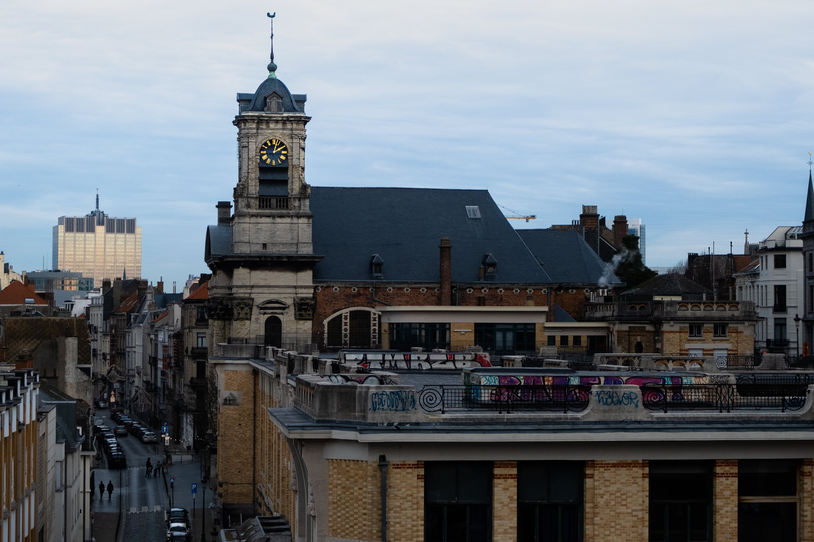
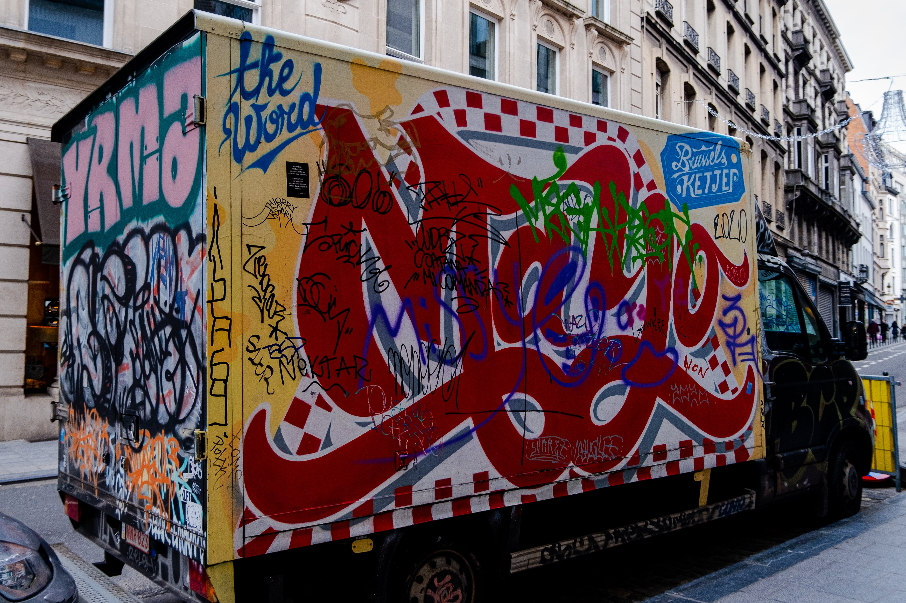
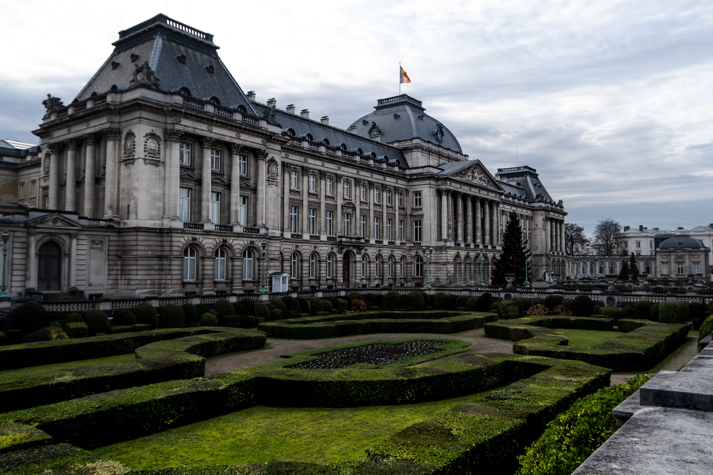
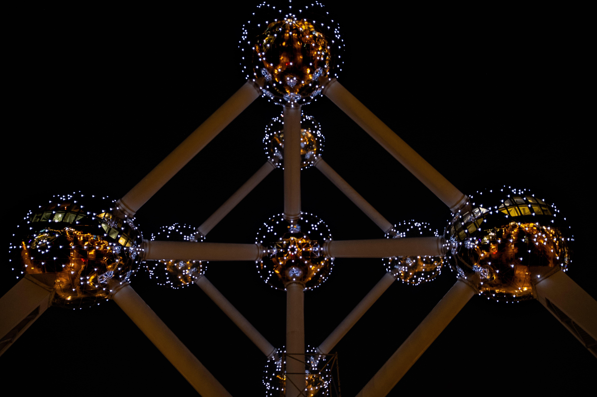

Brussels was a tiny city full of street art! We walked everywhere.

Started the day by visiting the Palaise de Justice. The views from up top were just splendid.

Walking past the streets, admiring all the eye-popping colors on a very gloomy day.

The Royal Palace was very royal and palacy.

Ended the trip with a visit to [Atomium](https://atomium.be).

