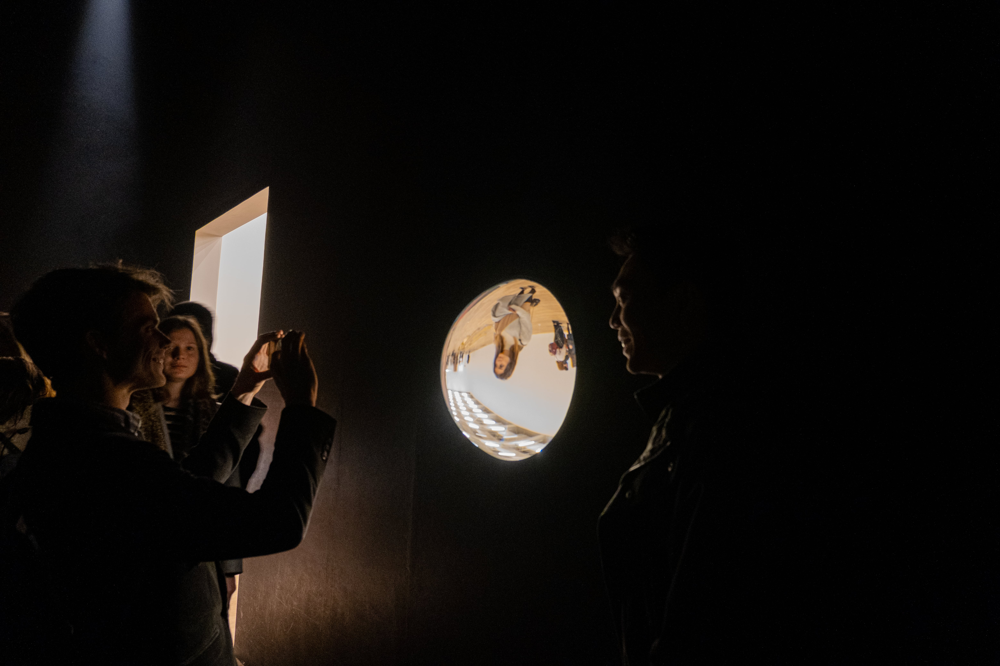
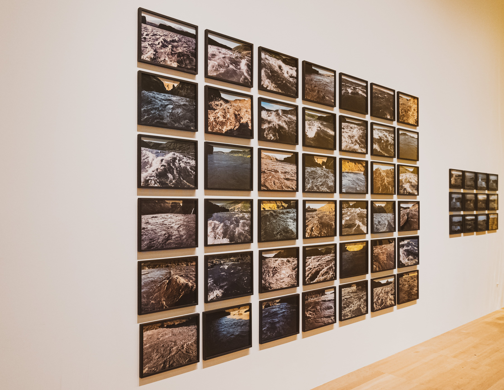
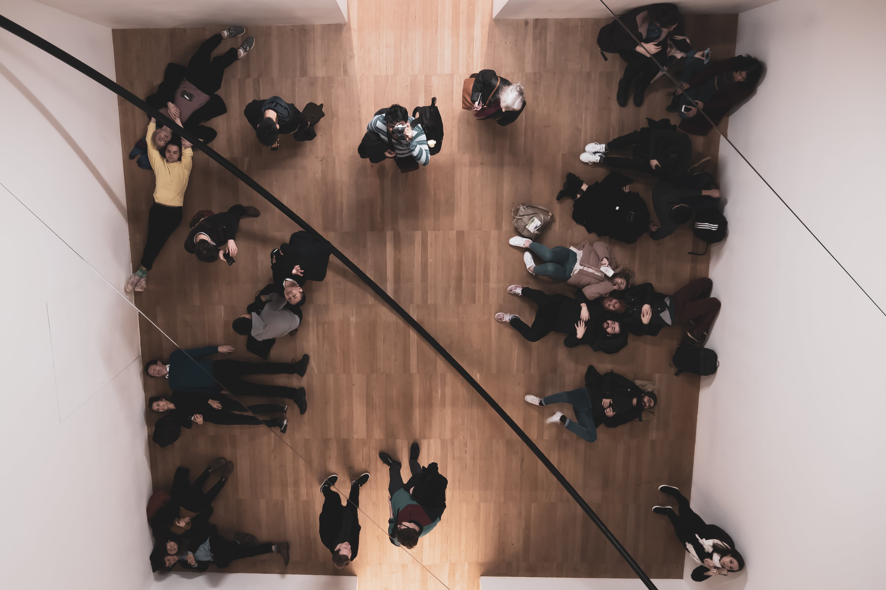
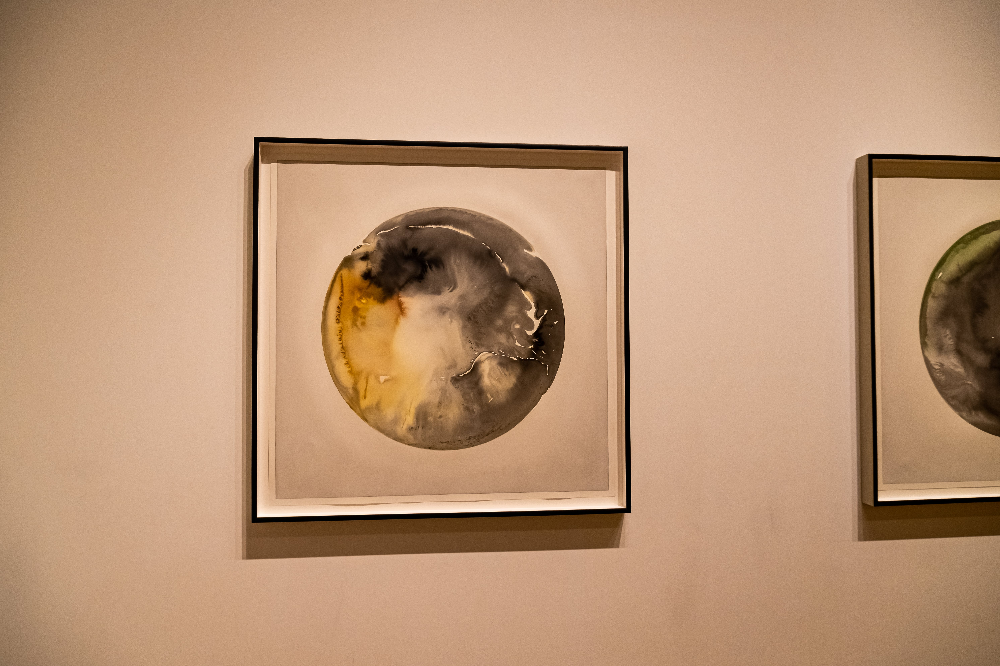
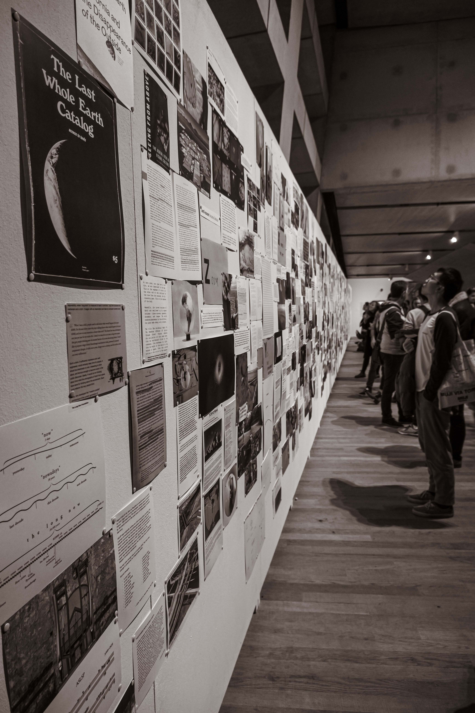
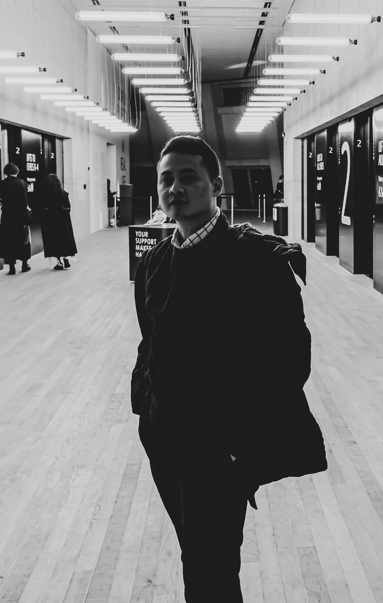
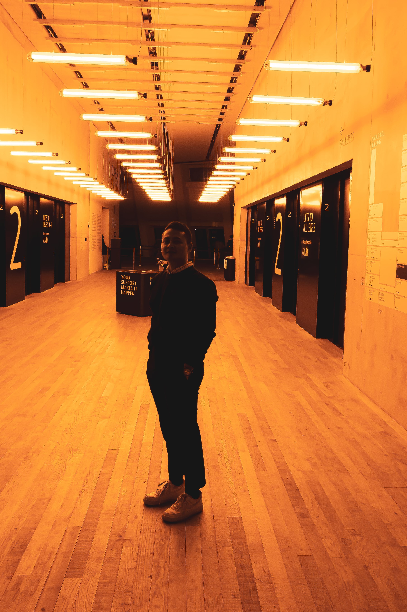
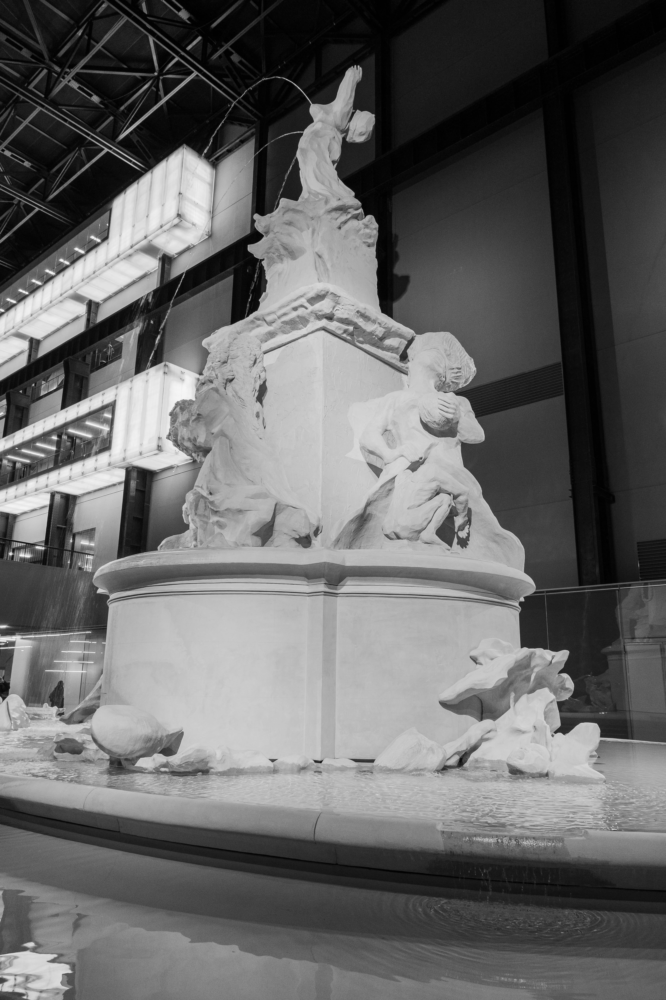

[Olafur Eliasson](https://olafureliasson.net/) is a Danish-Icelandic artist famous for using natural elements to enhance his large and small scale exhibits while creating awareness about climate change and its impact.

His exhibition at the Tate Modern museum in London beckoned once the term was over, and a few of us at GID decided to visit before the exhibit was taken down in January of 2020.

> A big thank you to [Christian Pugsley](https://www.cpugsley.com/) for booking the tickets and getting us all there.

Just barely made it in time for the 4pm exhibition. Thankfully, the London tube got us there in time.

The first few exhibits got us thinking about the various effects that can be created with light.

This was followed by a wall of contrast between the photos that Eliasson took in Iceland in 1999 and now, two decades later. It drove home the impact of climate change and a heating planet on the polar ice caps.

A shield made from minerals taken from the ice caps in Iceland.

After the exhibition was done, we came out to a room showing the thought process and research that went into creating the exhibits.

The lighting in the entry area to the exhibition, where we exited, prompted [Ziqq](http://ziqqsayshello.com/) to teach me something about portrait photography.

A couple more photos on our way out.

