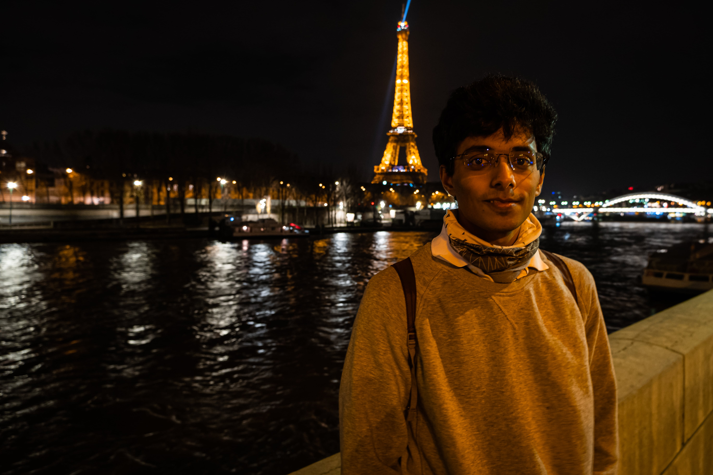

Christmas in Paris was just magical.

> Note to self, always check the public transport situation in Paris. Planned industrial action can ruin your own plans.

[Shashwat Joshi](https://in.linkedin.com/in/shashwat-joshi-ba5071ba) was my partner in crime for this trip.

It was an adventure into itself each day to reach our hotel, which was unfortunately in Zone 5 near the airport.

Cheesecake and eclairs!!

The Christmas market in front of the [Grande Arche](https://www.parisdigest.com/monument/la-grande-arche.htm) was magical.

Galeries lafayette was lit!

Off to the Eiffel tower.

The actual Christmas morning was deserted, which was to be expected.

Ended the trip with a visit to the [Sacre Coeur Basilica](http://www.sacre-coeur-montmartre.com/english/history-and-visit/), from where the views of the city were breathtaking.

